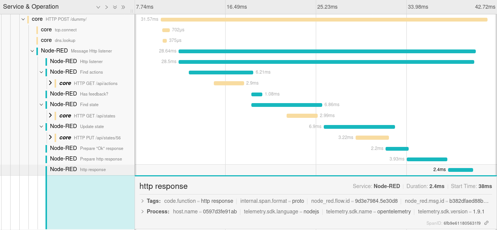
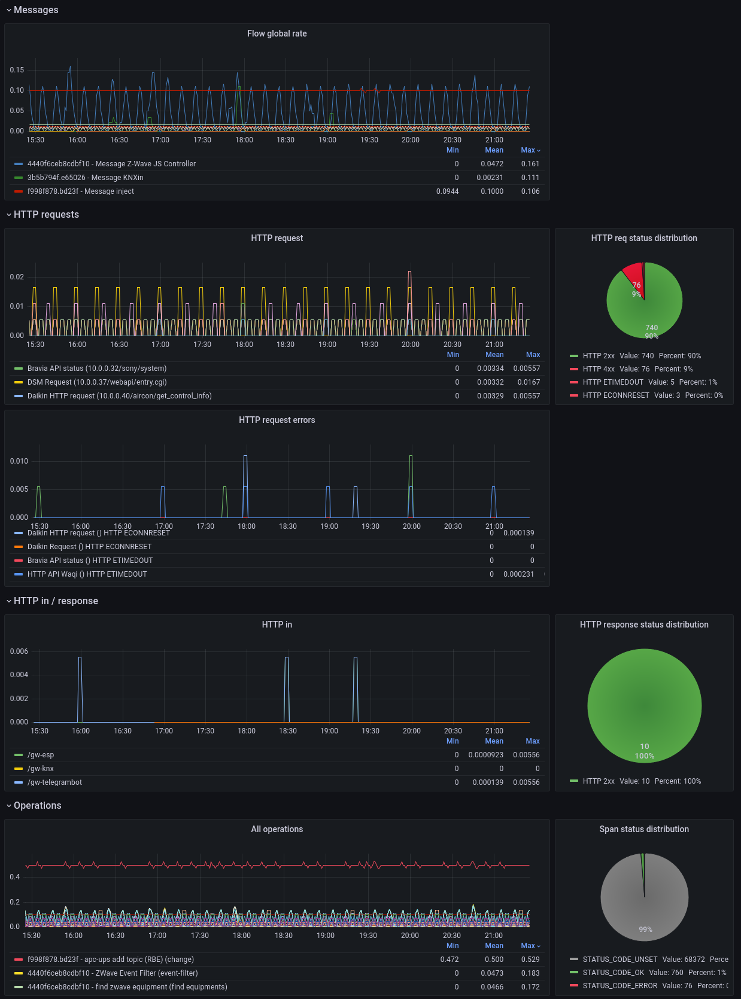

# Node-RED OpenTelemetry

[](https://www.gnu.org/licenses/lgpl-3.0)
[](https://github.com/frankvdb7/node-red-contrib-opentelemetry/releases/latest)
[](https://github.com/frankvdb7/node-red-contrib-opentelemetry/actions/workflows/nodejs.yml)
[](https://github.com/frankvdb7/node-red-contrib-opentelemetry/actions/workflows/publish-npmjs.yml)
[](https://www.npmjs.com/package/@frankvdb/node-red-contrib-opentelemetry)

Distributed tracing with OpenTelemetry SDK and Prometheus metrics exporter for Node-RED.

## Key Features

### Traces

- Powered by the [OpenTelemetry JavaScript framework](https://github.com/open-telemetry/opentelemetry-js) and [Node-RED messaging hooks](https://nodered.org/docs/api/hooks/messaging):
  - Automatically creates spans on `onSend(source)` and `postDeliver(destination)` events.
  - Automatically ends spans on `onComplete` and `postDeliver(source)` events.
- Each trace includes:
  - Message ID, Flow ID, Node ID, Node Type, Node Name (if provided).
  - Hostname.
  - Optional `http status code` (for request nodes).
  - Optional exception details.
  - Optional custom attributes based on message data (using JMESPath).





### Metrics

- Exports HTTP request metrics from `http in` nodes (ready for Prometheus scraping):
  - `method`, `route`, `status`, `ip`, `duration`.

``` bash
curl http://localhost:1881/metrics
# HELP target_info Target metadata
# TYPE target_info gauge
target_info{service_name="Node-RED",telemetry_sdk_language="nodejs",telemetry_sdk_name="opentelemetry",telemetry_sdk_version="1.30.0"} 1
# HELP http_request_duration Response time for incoming http requests in milliseconds
# UNIT http_request_duration ms
# TYPE http_request_duration histogram
http_request_duration_count{method="POST",route="/api/test",status="201",ip="127.0.0.1"} 5
http_request_duration_sum{method="POST",route="/api/test",status="201",ip="127.0.0.1"} 620
...
```

## Installation

**Requirement**: Node.js >= 22.0.0

Search for
 `@frankvdb/node-red-contrib-opentelemetry` in the Node-RED Palette Manager or install via npm:

``` bash
npm install @frankvdb/node-red-contrib-opentelemetry
```

Restart Node-RED after installation to pick up the new nodes.

## Usage

### Traces

1.  Add the **OTEL** node **once** to any flow.
2.  Configure the node:
    -   **Exporter URL**: Set your OTLP exporter endpoint (e.g., `http://localhost:4318/v1/traces` for Jaeger).
    -   **Protocol**: Choose `http/json` or `http/protobuf`.
    -   **Service Name**: The name displayed in your tracing backend.
    -   **Root Prefix**: Optional prefix for the root span name.
    -   **Ignored Types**: Comma-separated list of node types to exclude from tracing (e.g., `debug,catch`).
    -   **Propagate**: Comma-separated list of node types that should propagate [W3C trace context](https://www.w3.org/TR/trace-context/) (e.g., `http request`).
    -   **Timeout**: Seconds after which an unmodified message span will be closed.
    -   **Span Attribute Mappings**: Define custom attributes using [JMESPath](https://jmespath.org/) syntax to extract data from the `msg` object.

#### Environment Variables
You can also use standard OpenTelemetry environment variables:
- `OTEL_EXPORTER_OTLP_TRACES_ENDPOINT` (or `OTEL_EXPORTER_OTLP_ENDPOINT`)
- `OTEL_EXPORTER_OTLP_TRACES_PROTOCOL` (or `OTEL_EXPORTER_OTLP_PROTOCOL`)
- `OTEL_SERVICE_NAME`

Environment variables are used only if the corresponding node fields are left at their default values.

### Metrics

1.  Add the **Prometheus Exporter** node **once** to any flow.
2.  Configure the node:
    -   **Port**: The port where the metrics server will listen (e.g., `1881`).
    -   **Endpoint**: The scraping path (e.g., `/metrics`).
    -   **Service Name**: Displayed in the exported metrics.
3.  **Critical Step**: Enable the middleware in your `settings.js` file (typically found in `~/.node-red/settings.js`):

``` js
// 1. Import the prometheus middleware at the top of settings.js
const { prometheusMiddleware } = require('@frankvdb/node-red-contrib-opentelemetry/lib/prometheus-exporter.js');

module.exports = {
    // ...
    // 2. Add it to the httpNodeMiddleware property
    httpNodeMiddleware: prometheusMiddleware,
    // ...
}
```

## Examples

Example flows are provided in the [examples/](examples/) directory:
- [OpenTelemetry.json](examples/OpenTelemetry.json): A complete tracing demonstration flow.
- [Prometheus.json](examples/Prometheus.json): An HTTP endpoint demonstration flow with metrics.

You can import these into Node-RED using **Import** from the main menu (Ctrl-I).

## Versioning

This project follows [Semantic Versioning](https://semver.org/). See the [releases](https://github.com/frankvdb7/node-red-contrib-opentelemetry/releases) for the changelog.

## Contributors

- **[Nioc](https://github.com/nioc/)** - _Initial work_
- **[Wodka](https://github.com/wodka/)** - _AMQP headers and `CompositePropagator` (Jaeger, W3C, B3)_
- **[Akrpic77](https://github.com/akrpic77/)** - _MQTT v5 context fields_
- **[joshendriks](https://github.com/joshendriks/)** - _Protobuf trace-exporter support_
- **[frankvdb7](https://github.com/frankvdb7/)** - _Fork maintenance and updates_

## License

This project is licensed under the **GNU Lesser General Public License v3.0**. See the [LICENSE](LICENSE.md) file for details.
